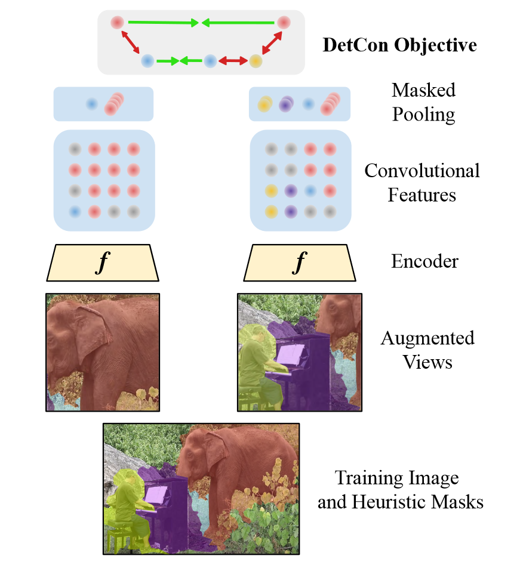

# detcon-pytorch
(WIP) PyTorch implementation of DeepMind's DetCon from ["Efficient Visual Pretraining with Contrastive Detection" Henaff et al. (ICCV 2021)](https://arxiv.org/abs/2103.10957)

</img>
